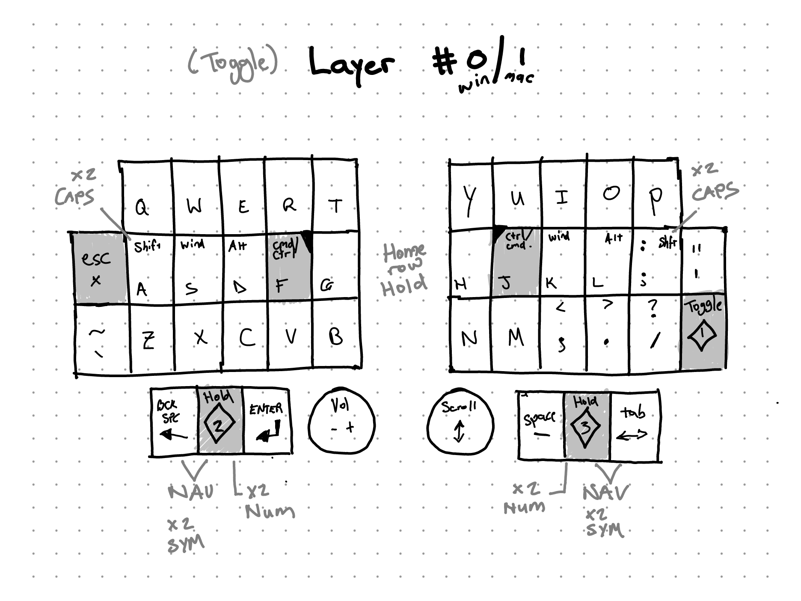
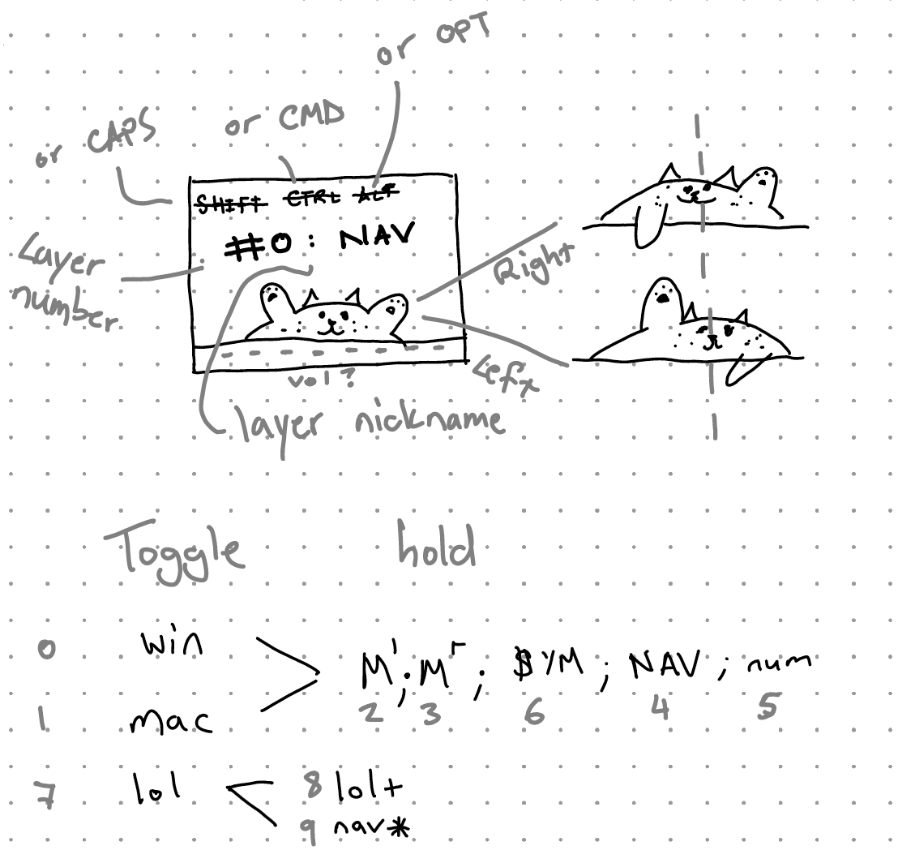

# by Werner
Konrad Variant, 40 key column-staggered split keyboard, encoders, OLED displays.

## Keymap
QWERTY (Windows/Mac variants) with navigation-, number-, math-, and symbol layers.
Featuring left-only League of Legends layer.

See [detailed layers](docs/layers.pdf).

If you choose one of the other layouts you can use the matching template in the default keymap.\
If you choose Konrad or Saegewerk and plan on using LEDs you need to uncomment the appropiate lines in the `klor.c` file.

## LCD
Landscape, 128x64 pixels.

## RP2040 Sea-Picro
Place the klor folder from this repository in the keyboards folder of your qmk installation.\
Most of the RP2040 MCUs use the same pinout, the Adafruit KB2040 is an exclusion. If you plan on using it you need to uncomment the appropiate lines in the `/2040/rules.mk` file.\
Than you can use this command to compile the RP2040 firmware for the KLOR.

`qmk compile -kb klor/2040 -km default`

## TODO
- [ ] solder & assemble
- [ ] program Layers
- [ ] custom OLED animation ([tutorial](https://www.youtube.com/watch?v=OJSOEStpPIo))
- [ ] haptic feedback (+ peripheral side)
- [ ] audio
- [ ] fixed LED backlight
