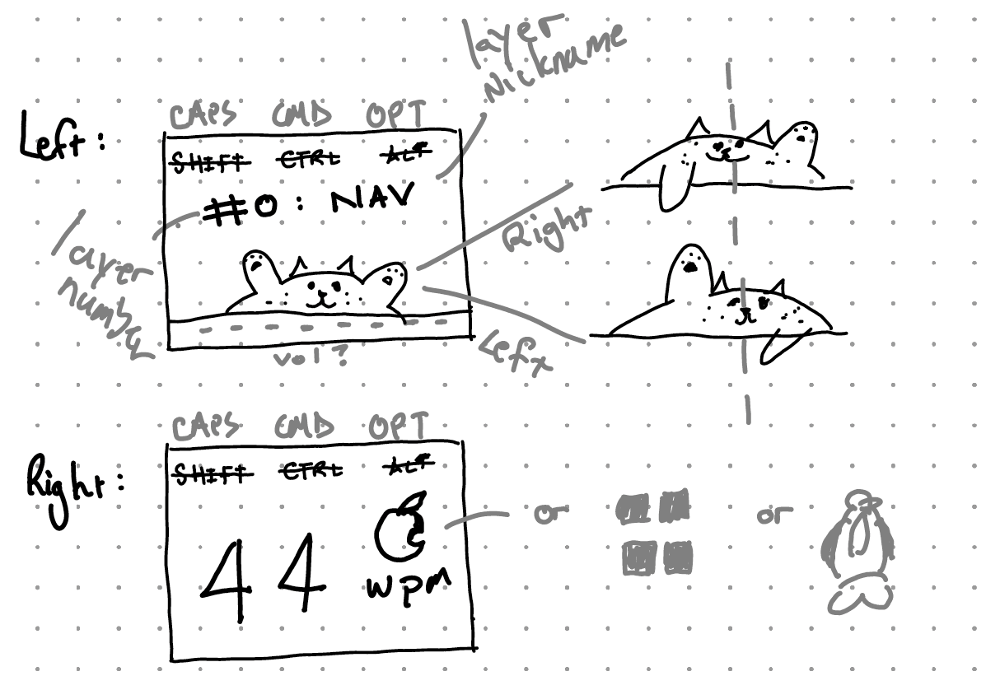

```
█         █    █            ▄▄▄▀▀▀▀▀▀▄▄▄        █▀▀▀▀▀▀▀▀▀▀█
█        █     █          ▄▀            ▀▄      █          █
█       █      █        ▄▀                ▀▄    █          █
█      █       █        █                  █    █          █  █
█     █        █       █                    █   █          █      ████   ██████████   █████        
█    █         █       █                    █   █▄▄▄▄▄▄▄▄▄▄█  █  █    █      █             █ 
█   █ █        █       █                    █   █      █      █  █           █             █ 
█  █   █       █        █                  █    █       █     █    ███       █         █████   
█ █     █      █        ▀▄                ▄▀    █        █    █       █      █       █     █    
██       █     █          ▀▄            ▄▀      █         █   █  █     █     █       █     █  
█         █    █▄▄▄▄▄▄▄▄    ▀▀▀▄▄▄▄▄▄▀▀▀        █          █  █   █████      █        ███████          
```
# by Werner
KLOR Konrad Variant, 40 key column-staggered split keyboard, encoders, OLED displays.


## 8 Layer Keymap
QWERTY (Windows/Mac variants) with navigation-, number-, math-, and symbol layers.\
ft. League of Legends layer (*left-only).


See [detailed layers](docs/layers.pdf).

## OLED
Landscape, 128x64 pixels.





## RP2040 Sea-Picro
Place in the keyboards folder of your qmk installation.\
Than you can use this command to compile the RP2040 firmware for the KLOR.

`qmk compile -kb klor/2040 -km default`


## TODO
- [ ] solder & assemble
- [ ] program Layers
- [ ] L/R OLED ft wpm animation ([tutorial](https://www.youtube.com/watch?v=OJSOEStpPIo))
- [ ] audio
- [ ] fixed LED backlight
- [ ] haptic feedback (peripheral side..?)
- [ ] RGB Matrix (I2C limit..?)
